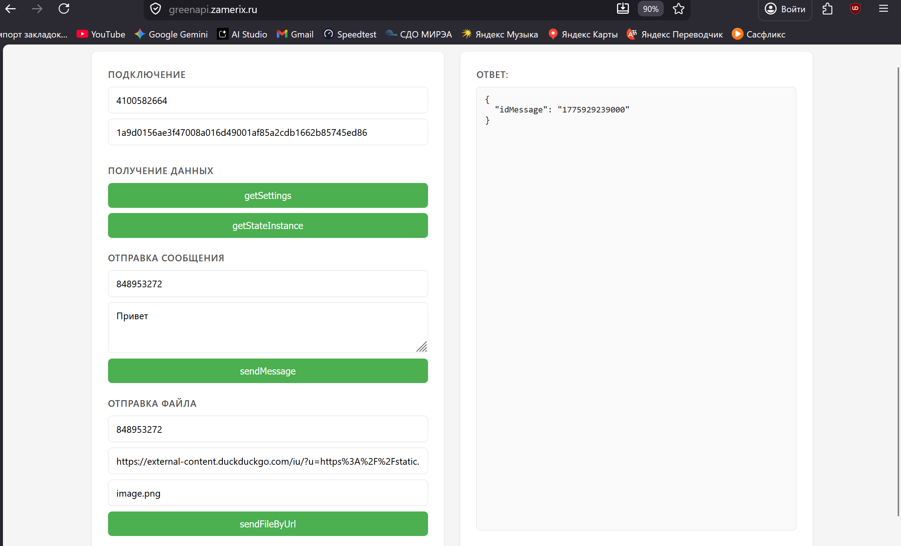
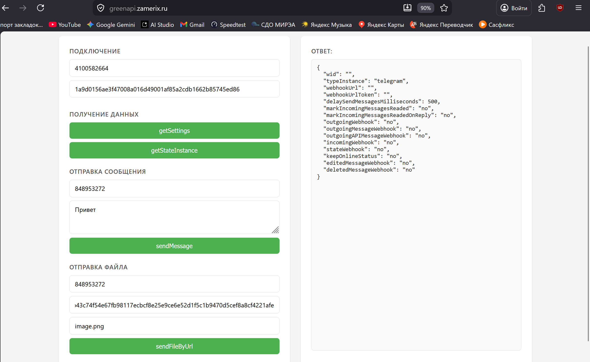
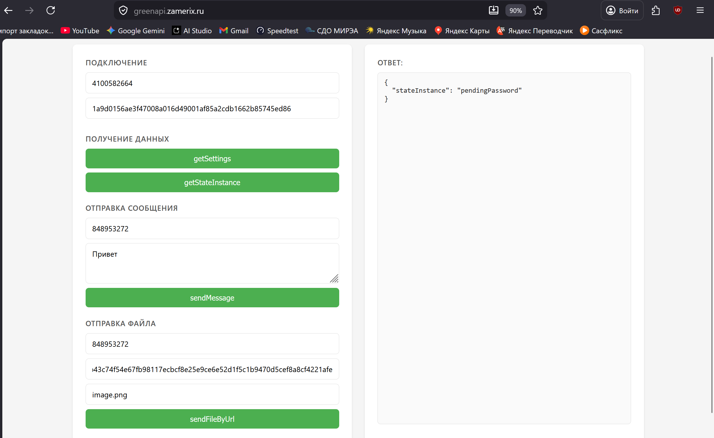
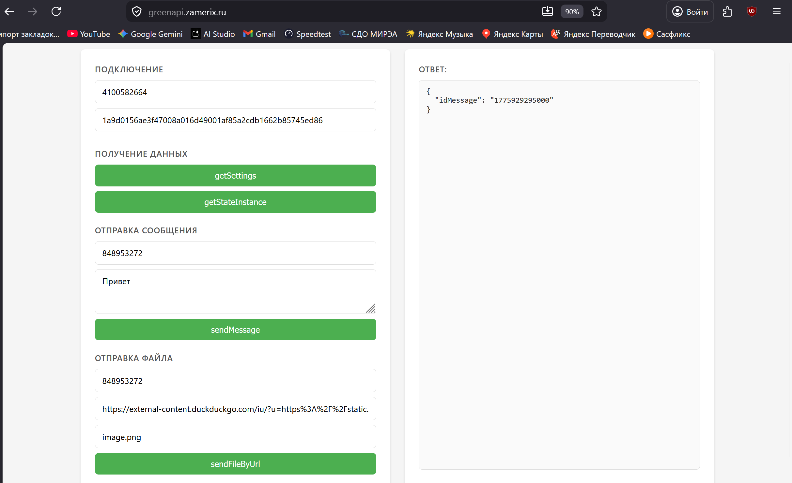

# GREEN-API Client

Веб-приложение для работы с [GREEN-API](https://green-api.com/) — сервисом WhatsApp-интеграции. Через браузерный интерфейс позволяет вызывать четыре метода API: получение настроек и состояния инстанса, отправку текстовых сообщений и файлов по URL.

Go-сервер выступает прокси между фронтендом и GREEN-API: принимает `idInstance`/`apiTokenInstance` в теле запроса (а не в URL), что исключает попадание токенов в логи nginx и историю браузера.

## Содержание

- [Возможности](#возможности)
- [Видео-демонстрация](#видео-демонстрация)
- [Поддерживаемые методы](#поддерживаемые-методы)
- [Архитектура](#архитектура)
- [Скриншоты](#скриншоты)
- [Требования](#требования)
- [Быстрый старт](#быстрый-старт)
- [Конфигурация](#конфигурация)
- [Task Runner](#task-runner)
- [API](#api)
- [Примеры запросов](#примеры-запросов)
- [Структура проекта](#структура-проекта)
- [CI/CD](#cicd)

## Возможности

- Веб-интерфейс по макету ТЗ — двухколоночный layout с формами слева и панелью ответа справа
- Прокси к четырём методам GREEN-API через единый Go-сервер
- Structured logging (`log/slog`) — JSON в production, human-friendly в dev
- Rate-limiter по IP (token-bucket) поверх всех `/api/*` эндпоинтов
- Graceful shutdown по `SIGINT`/`SIGTERM`
- Embed.FS для статики — один бинарник без внешних зависимостей
- Docker multi-stage build, docker-compose с nginx reverse-proxy
- CI/CD на GitHub Actions: lint → test → push в GHCR → деплой на VPS по SSH

## Видео-демонстрация

<a href="https://drive.google.com/file/d/1lyeXROrBcO6vkbFKKTJn060ati2ZBEdb/view?usp=sharing" target="_blank">
  
</a>

## Поддерживаемые методы

| Метод              | Описание                          |
| ------------------ | --------------------------------- |
| `getSettings`      | Получение настроек инстанса       |
| `getStateInstance` | Получение состояния инстанса      |
| `sendMessage`      | Отправка текстового сообщения     |
| `sendFileByUrl`    | Отправка файла по URL             |

## Архитектура

```
                    ┌──────────────────────────────────────────────┐
                    │                VPS (Docker)                  │
                    │                                              │
┌──────────┐        │  ┌───────┐       ┌──────────────────┐        │       ┌────────────────────┐
│ Браузер  │───────▶│  │ nginx │──────▶│  Go HTTP Server  │────────┼──────▶│ api.green-api.com  │
│          │◀───────│  │  :80  │◀──────│      :8080       │◀───────┼───────│                    │
└──────────┘        │  └───────┘       └──────────────────┘        │       └────────────────────┘
                    │      ▲                    ▲                  │
                    │      │                    │                  │
                    │   статика           rate-limit + slog        │
                    └──────────────────────────────────────────────┘

                    ┌──────────────────────────┐
                    │     GitHub Actions       │
                    │  push → lint → test →    │
                    │  build → GHCR → SSH      │
                    └──────────────────────────┘
```

- **nginx** — reverse-proxy, отдаёт статику из `static/`, проксирует `/api/*` и `/health` в Go-сервер
- **Go-сервер** — бизнес-логика, проксирование запросов к GREEN-API, rate-limit, structured logging
- **GitHub Actions** — автоматический деплой в GHCR + SSH-pull на VPS при push в `main`

## Скриншоты

**getSettings** — получение настроек инстанса:



**getStateInstance** — получение состояния инстанса:



**sendMessage** — отправка текстового сообщения:


**sendFileByUrl** — отправка файла по URL:



## Требования

- Go **1.26+**
- [Task](https://taskfile.dev/) — опционально, для удобного запуска команд
- Docker + Docker Compose — опционально, для запуска полного стека с nginx

## Быстрый старт

### Локально (без Docker)

```bash
git clone https://github.com/{user}/green-api-client.git
cd green-api-client

# через go run
go run ./cmd/server/main.go

# или через Task Runner
task run
```

Приложение будет доступно по адресу http://localhost:8080.

### Docker Compose (с nginx)

```bash
git clone https://github.com/{user}/green-api-client.git
cd green-api-client

task docker:up
# или напрямую
docker compose up --build -d
```

Стек поднимется на двух контейнерах: `greenapi_app` (Go) и `greenapi_nginx`. nginx слушает порт `80` в сети контейнеров — пробросьте его наружу через `ports` в `docker-compose.yml` или используйте внешний reverse-proxy.

Остановка:

```bash
task docker:down
```

## Конфигурация

| Переменная | По умолчанию | Описание                                      |
| ---------- | ------------ | --------------------------------------------- |
| `PORT`     | `8080`       | Порт HTTP-сервера                             |
| `ENV`      | `local`      | Окружение (`local` — text-логи, иначе — JSON) |

## Task Runner

Проект использует [Taskfile](https://taskfile.dev/) для автоматизации:

```bash
task run          # запустить сервер
task build        # собрать бинарник в ./bin/server
task test         # запустить тесты
task test:cover   # покрытие тестами
task lint         # golangci-lint
task docker:up    # поднять контейнеры
task docker:down  # остановить контейнеры
```

## API

Go-сервер проксирует запросы к GREEN-API. Все `/api/*` эндпоинты принимают `idInstance` и `apiTokenInstance` в теле запроса — токен не попадает в URL и логи.

### GET /health

Healthcheck-эндпоинт.

**Ответ:**
```json
{ "status": "ok" }
```

### POST /api/getSettings

Получение настроек инстанса.

**Тело запроса:**
```json
{
  "idInstance": "1101234567",
  "apiTokenInstance": "abc123def456..."
}
```

### POST /api/getStateInstance

Получение состояния инстанса.

**Тело запроса:**
```json
{
  "idInstance": "1101234567",
  "apiTokenInstance": "abc123def456..."
}
```

### POST /api/sendMessage

Отправка текстового сообщения.

**Тело запроса:**
```json
{
  "idInstance": "1101234567",
  "apiTokenInstance": "abc123def456...",
  "chatId": "77771234567@c.us",
  "message": "Hello World!"
}
```

### POST /api/sendFileByUrl

Отправка файла по URL. Имя файла извлекается из последнего сегмента пути URL.

**Тело запроса:**
```json
{
  "idInstance": "1101234567",
  "apiTokenInstance": "abc123def456...",
  "chatId": "77771234567@c.us",
  "urlFile": "https://example.com/image.png"
}
```

**Формат ошибок** (все эндпоинты):
```json
{ "error": "описание ошибки" }
```

## Примеры запросов

```bash
# healthcheck
curl http://localhost:8080/health

# получить настройки инстанса
curl -X POST http://localhost:8080/api/getSettings \
  -H "Content-Type: application/json" \
  -d '{
    "idInstance": "1101234567",
    "apiTokenInstance": "abc123def456..."
  }'

# получить состояние инстанса
curl -X POST http://localhost:8080/api/getStateInstance \
  -H "Content-Type: application/json" \
  -d '{
    "idInstance": "1101234567",
    "apiTokenInstance": "abc123def456..."
  }'

# отправить сообщение
curl -X POST http://localhost:8080/api/sendMessage \
  -H "Content-Type: application/json" \
  -d '{
    "idInstance": "1101234567",
    "apiTokenInstance": "abc123def456...",
    "chatId": "77771234567@c.us",
    "message": "Hello World!"
  }'

# отправить файл по URL
curl -X POST http://localhost:8080/api/sendFileByUrl \
  -H "Content-Type: application/json" \
  -d '{
    "idInstance": "1101234567",
    "apiTokenInstance": "abc123def456...",
    "chatId": "77771234567@c.us",
    "urlFile": "https://example.com/image.png"
  }'
```

## Структура проекта

```
green-api-client/
├── cmd/
│   └── server/
│       └── main.go              # точка входа, роутинг, graceful shutdown
├── internal/
│   ├── greenapi/
│   │   ├── client.go            # HTTP-клиент для GREEN-API
│   │   └── client_test.go       # unit-тесты клиента (httptest)
│   ├── handler/
│   │   ├── handler.go           # HTTP-хендлеры
│   │   └── handler_test.go      # unit-тесты хендлеров
│   └── middleware/
│       └── ratelimit.go         # rate-limiter по IP (token-bucket)
├── pkg/
│   └── logger/
│       ├── sl/                  # хелперы для log/slog
│       └── slogpretty/          # human-friendly handler для dev
├── static/
│   ├── index.html               # веб-интерфейс
│   ├── style.css                # стили
│   └── script.js                # логика фронтенда
├── deployments/
│   └── nginx/
│       └── nginx.conf           # конфиг reverse-proxy
├── .github/
│   └── workflows/
│       └── deploy.yml           # CI/CD pipeline
├── docs/                        # справочные материалы
├── static.go                    # embed.FS для статики
├── Dockerfile                   # multi-stage build
├── docker-compose.yml           # оркестрация app + nginx
├── Taskfile.yml                 # команды сборки и запуска
├── .golangci.yml                # конфигурация линтера
├── go.mod
└── go.sum
```

## CI/CD

GitHub Actions pipeline ([.github/workflows/deploy.yml](.github/workflows/deploy.yml)):

1. **lint** — `golangci-lint` на всём коде
2. **test** — `go test ./... -race -count=1`
3. **deploy** (только при push в `main`):
   - сборка multi-stage Docker-образа
   - публикация в GitHub Container Registry (`ghcr.io`)
   - SSH на VPS → `git pull` → `docker compose pull` → `up -d --force-recreate`

Секреты, требуемые для деплоя: `VPS_HOST`, `VPS_USER`, `VPS_SSH_KEY`, `GHCR_TOKEN`.
